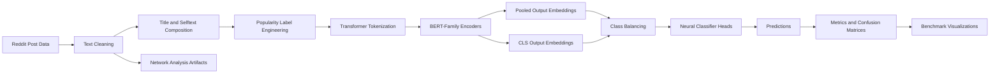

# Data Mining: Reddit Post Popularity Classification

**Transformer-based NLP benchmarking project for classifying social media post popularity with BERT-family embeddings, neural network heads, class-balancing strategies, and detailed model evaluation.**

[GitHub profile](https://github.com/sntk-76)

## Overview

This project studies whether the textual content of Reddit posts can be used to predict post popularity. The system converts post titles and body text into Transformer-based semantic representations, then benchmarks multiple neural architectures for a three-class popularity classification problem.

The repository is structured as an applied data mining and NLP research workflow: data extraction, text cleaning, label engineering, embedding generation, imbalance handling, neural model comparison, error analysis, and visualization. It is designed to show not only a working classifier, but also a disciplined experimental process for comparing representation choices and model families.

## Problem Definition

The target variable is derived from Reddit's `upvote_ratio`, turning a continuous engagement signal into a supervised multi-class task:

| Label | Popularity Band | Rule |
| --- | --- | --- |
| `0` | Low popularity | `upvote_ratio <= 0.50` |
| `1` | Average popularity | `0.50 < upvote_ratio <= 0.80` |
| `2` | High popularity | `upvote_ratio > 0.80` |

The objective is to evaluate how well contextual language embeddings and neural classifiers can separate posts by engagement outcome.

## Why This Project Matters

Popularity prediction is a realistic social-media mining problem because engagement is noisy, imbalanced, and influenced by language, topic framing, community context, and timing. A keyword-only model is too shallow for this kind of task, so the project uses Transformer embeddings to capture richer semantic patterns from `title` and `selftext`.

For recruiters and technical reviewers, the project demonstrates practical machine learning judgment: thoughtful labeling, preprocessing, imbalance treatment, systematic benchmarking, and metric-driven comparison across several model designs.

## Core Capabilities

| Capability | Implementation |
| --- | --- |
| Reddit text mining | Extracts and structures post metadata, titles, self-text, comments, and engagement signals. |
| Label engineering | Converts `upvote_ratio` into low, average, and high popularity classes. |
| Text cleaning | Filters null and noisy records, combines textual fields, and prepares model-ready text. |
| Transformer embeddings | Benchmarks BERT-family encoders including BERT, RoBERTa, ALBERT, and TinyBERT-style variants. |
| Representation comparison | Evaluates both pooled output and CLS-token representations. |
| Imbalance handling | Compares oversampling, undersampling, and SMOTE-style augmentation strategies. |
| Neural classifier benchmarking | Tests dense, residual, progressive, convolutional, autoencoder, and attention-based classifier heads. |
| Evaluation and reporting | Produces accuracy, precision, recall, F1-score, confusion matrices, label accuracy plots, and model-comparison figures. |

## Architecture



## Technical Stack

| Layer | Tools |
| --- | --- |
| Language | Python |
| Data processing | Pandas, NumPy |
| NLP and embeddings | Hugging Face Transformers, BERT, RoBERTa, ALBERT, TinyBERT-style models |
| Modeling | TensorFlow, Keras, dense networks, CNNs, autoencoders, attention-style heads |
| Imbalance handling | SMOTE, oversampling, undersampling |
| Evaluation | Scikit-learn metrics, classification reports, confusion matrices |
| Visualization | Matplotlib, Seaborn, Plotly, NetworkX |

## Repository Structure

```text
Data-Mining/
|-- assets/
|   `-- data-mining-cover.png
|-- codes/
|   |-- Data extraction.ipynb
|   |-- Cleaning_text.ipynb
|   `-- mpdel implementation.ipynb
|-- data/
|   |-- original_data.csv
|   |-- text_filtered_data.csv
|   |-- nodes.csv
|   `-- edgelist.csv
|-- outputs/
|   |-- bert_base.txt
|   |-- roberta_base.txt
|   |-- albert_base.txt
|   `-- tinybert.txt
|-- Results/
|   |-- Clean data/
|   |-- unclean data/
|   `-- network/
|-- LICENSE
`-- README.md
```

## Experimental Design

The project compares several dimensions of the NLP pipeline:

| Dimension | Variants |
| --- | --- |
| Encoder family | BERT, RoBERTa, ALBERT, TinyBERT-style models |
| Embedding output | Pooled output vs. CLS-token output |
| Data condition | Cleaned vs. uncleaned data |
| Class balancing | Oversampling, undersampling, SMOTE |
| Classifier architecture | Original dense network, residual network, progressive network, CNN, autoencoder, attention-based model |
| Metrics | Accuracy, precision, recall, F1-score, confusion matrix, per-label accuracy |

This matrix of experiments makes the repository more than a single model run: it is a controlled benchmark of representation and classifier choices.

## Results Summary

The saved reports in `outputs/` show that several configurations reach approximately **0.91-0.92 accuracy** on the evaluated test split of 828 samples. ALBERT and TinyBERT-style configurations are particularly competitive in the saved results, while BERT and RoBERTa also maintain strong performance across multiple classifier heads.

Key evaluation artifacts include:

- `outputs/bert_base.txt`
- `outputs/roberta_base.txt`
- `outputs/albert_base.txt`
- `outputs/tinybert.txt`
- `Results/**/overall_accuracy.png`
- `Results/**/f1_score_comparison.png`
- `Results/**/precision_recall_per_label.png`
- `Results/**/confusion_matrices.png`
- `Results/network/network.png`

## Modeling Workflow

1. Extract Reddit post data and relevant engagement metadata.
2. Clean and filter text fields.
3. Combine `title` and `selftext` to preserve post context.
4. Convert `upvote_ratio` into supervised popularity labels.
5. Tokenize post text with Transformer tokenizers.
6. Generate contextual embeddings from BERT-family encoders.
7. Prepare pooled-output and CLS-output feature sets.
8. Apply class-balancing strategies to address engagement skew.
9. Train and compare neural classifier heads.
10. Evaluate predictions with per-class and aggregate metrics.
11. Save visual diagnostics for model comparison and error analysis.

## Project Highlights

- Treats social-media popularity prediction as a serious supervised NLP benchmark.
- Compares multiple Transformer encoders and embedding extraction strategies.
- Evaluates several neural architectures rather than relying on a single classifier.
- Addresses class imbalance with multiple resampling approaches.
- Produces detailed visual diagnostics for model quality and failure patterns.
- Includes network-analysis artifacts that support broader social-data exploration.

## How to Reproduce

The project is notebook-driven. Open and run the notebooks in this order:

```text
codes/Data extraction.ipynb
codes/Cleaning_text.ipynb
codes/mpdel implementation.ipynb
```

Recommended Python dependencies:

```bash
pip install pandas numpy scikit-learn imbalanced-learn tensorflow transformers matplotlib seaborn plotly networkx
```

The Transformer notebooks may require substantial memory and runtime depending on the selected encoder and hardware.

## Future Improvements

- Add a script-based training entry point in addition to notebooks.
- Track experiments with MLflow or Weights & Biases.
- Add cross-validation and hyperparameter search.
- Compare Transformer embeddings against TF-IDF and classical ML baselines.
- Add metadata features such as subreddit, posting time, and number of comments.
- Package the best model behind a small inference API or dashboard.

## License

This project is licensed under the [MIT License](LICENSE).
